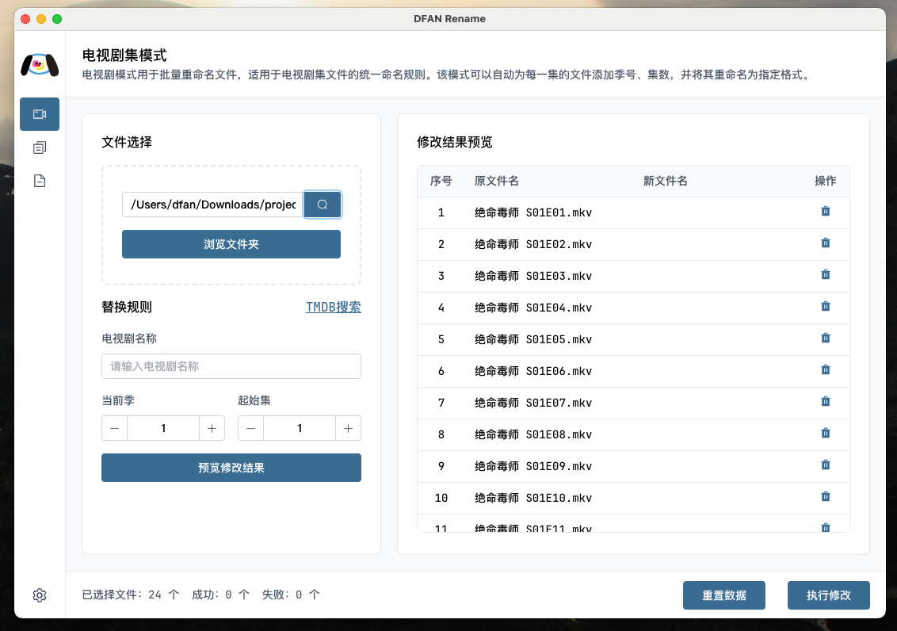
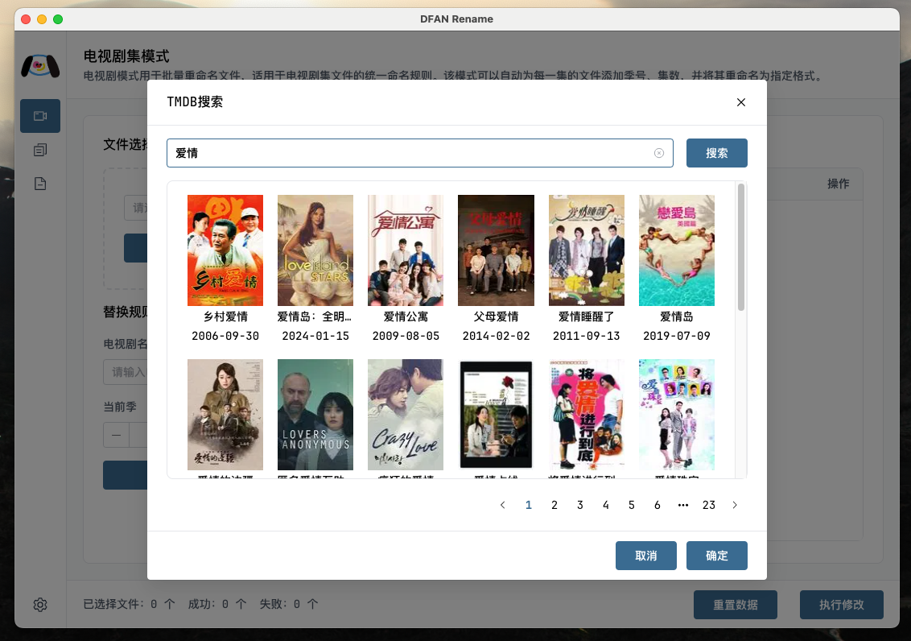

<p align="center">
  
</p>
<h1 align="center">DFAN Rename</h1>

<p align="center">
  一个为 Emby / Jellyfin / Plex 等媒体服务器量身打造的影视重命名工具，<br>
  让你的本地视频库刮削更精准，管理更轻松。
</p>

<p align="center">
  <a href="https://github.com/your-username/media-renamer/releases">
    
  </a>
  <a href="https://github.com/your-username/media-renamer/issues">
    
  </a>
  <a href="https://github.com/your-username/media-renamer">
    
  </a>
</p>

## 📝 项目简介

**DFAN Rename** 是一款专为本地视频库打造的影视文件重命名工具，支持 Emby / Jellyfin / Plex 等主流媒体服务器推荐的命名规范。

📁 一键整理混乱文件名<br>
🎬 提高刮削识别率，提升媒体库观感<br>
🧰 提供三种重命名模式：<br>

- 📺 **电视剧模式**：标准剧集命名（如 `剧名 S01E01.mkv`）
- 🔁 **批量替换**：快速替换文件名中的关键字
- ✏️ **插入文本**：在文件名前后插入自定义文本

## 🚀 功能特性

- ✅ 支持电视剧命名格式（如：`剧名 S01E01.mkv`）
- 🔁 支持批量替换文件名中的指定文本
- ✏️ 支持在文件名前后插入自定义文本
- 🎯 支持文件拖拽排序，手动调整文件顺序
- 🖥️ 图形化界面，操作简洁直观
- 🔄 预览修改结果，防止误操作
- 💻 跨平台支持：Windows / macOS / Linux

## 🖼️ 应用界面预览

### 🎛️ 主界面

<p>
  
</p>

### 🔍 TMDB 搜索功能

<p>
  
</p>

## 📥 下载与使用

你可以在 [Releases 页面](https://github.com/your-username/media-renamer/releases) 下载适用于你操作系统的最新版本，安装后即可使用：

| 系统平台   | 安装包下载地址                                                                  |
| ---------- | ------------------------------------------------------------------------------- |
| 🪟 Windows | [下载 EXE](https://github.com/your-username/media-renamer/releases/latest)      |
| 🍎 macOS   | [下载 DMG](https://github.com/your-username/media-renamer/releases/latest)      |
| 🐧 Linux   | [下载 AppImage](https://github.com/your-username/media-renamer/releases/latest) |

### 或者，你也可以自行构建和运行开发版本：

```bash
# 克隆仓库
git clone https://github.com/your-username/media-renamer.git
cd media-renamer

# 安装依赖
pnpm install

# 启动开发环境
pnpm dev

# 构建生产版本
pnpm build:win   # Windows
pnpm build:mac   # macOS
pnpm build:linux # Linux
```

## 📚 使用说明

### 📺 电视剧模式

> 将文件命名为标准剧集格式，如：`剧名 S01E01.mkv`，方便媒体服务器自动识别剧集信息。

#### 🛠️ 操作步骤：

1. 点击 **「选择文件夹」**，选中包含剧集的视频文件夹；
2. 输入剧名、季数与起始集数，或点击 **「TMDB 搜索」** 以关键词搜索剧集；
3. 预览修改后的命名格式；
4. 点击 **「执行重命名」** 即可完成。

> 💡 TMDB 搜索可自动填入剧名和季数，避免拼写错误，提高刮削准确率。

### 🔁 替换文本模式

> 替换文件名中指定的旧文本为新文本，适用于清除无效标识或统一命名格式。

#### 🛠️ 操作步骤：

1. 点击 **「选择文件夹」**；
2. 输入需要替换的旧文本 与 新文本；
3. 点击 **「预览修改结果」**；
4. 确认无误后点击 **「执行重命名」**。

### ✏️ 插入文本模式

> 批量在文件名前/后插入指定文本，例如添加统一前缀或标记。

#### 🛠️ 操作步骤：

1. 点击 **「选择文件夹」**；
2. 输入插入的文本内容；
3. 选择插入位置：开头 / 结尾；
4. 点击 **「预览修改结果」**，确认后点击 **「执行重命名」**。

## ⚠️ 注意事项

- 重命名前请务必备份重要文件，避免无法恢复。
- 本工具不会对视频内容做任何更改，仅修改文件名。

## 🙌 特别感谢

感谢 **小薯条** 提供的 Logo、想法与 UI 建议，为本项目注入了极大的灵感和美感提升！<br>
感谢你使用 **DFAN Rename**，希望它能帮助你更好地管理本地媒体库！
